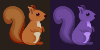
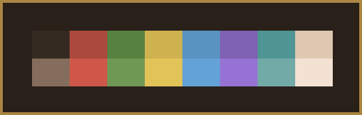
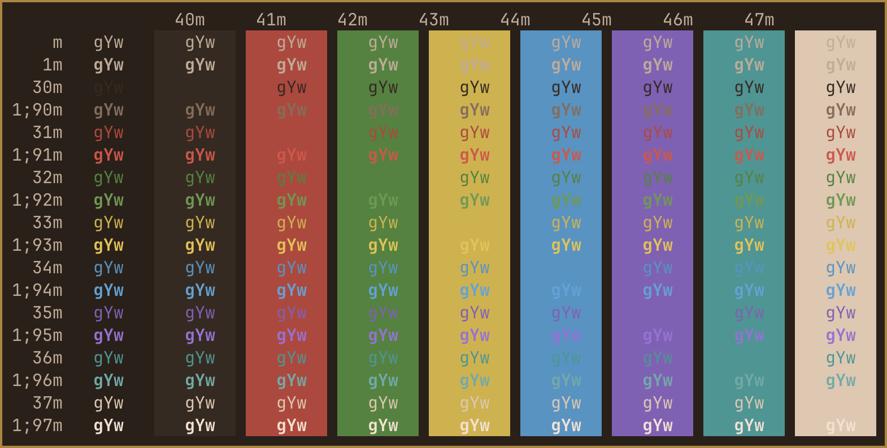
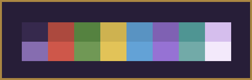
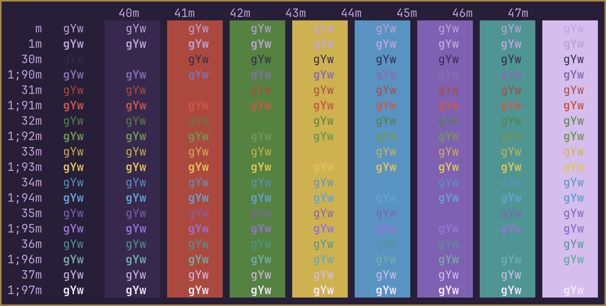

# Squirrelsong Ghostty
My own custom made Squirrelsong color schemes for Ghostty.

 

* [Ghostty for macOS and Linux](https://ghostty.org/)

* [Squirrelsong color scheme](https://github.com/sapegin/squirrelsong) 

Place files in ~/.config/ghostty/themes/ (create folders if non-existing).

*Squirrelsong*

 

 

*Squirrelsong Purple*

 

